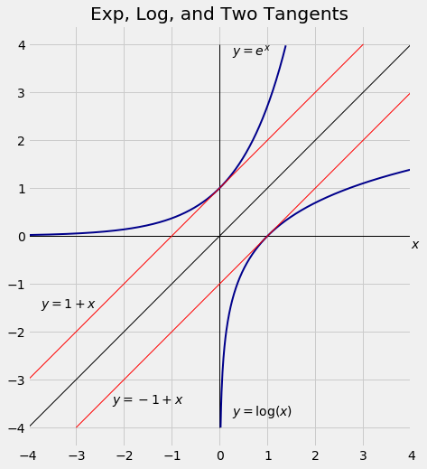
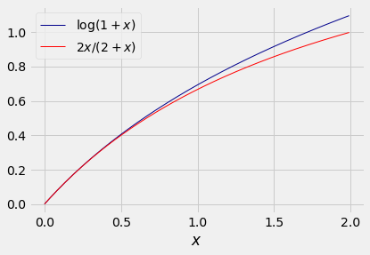
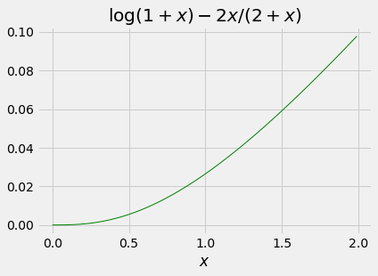

### Limits and Approximations ###

For all $x$,

$$
e^x ~~ = ~~ \lim_{n \to \infty} \big{(} 1 + \frac{x}{n} \big{)}^n
~~ = ~~ \sum_{k = 0}^\infty \frac{x^k}{k!}
$$

The expansion as a sum implies that 

$$
e^x ~~ \sim ~~ 1 + x ~~~~~~~~ \text{for small } x
$$

Here the symbol $\sim$ means that the ratio of the two sides goes to 1 as $x$ goes to 0. 

You can see this approximation in the figure. Around $x = 0$, the blue graph of $e^x$ and the red graph of $1+x$ are almost indistinguishable.

Take $\log$ on both sides to see that

$$
\log(1+x) ~~ \sim x ~~~~~~~~ \text{for small } x
$$

To spot this in the figure, look at values near 1 on the horizontal axis. You can see that $\log(x) \sim  -1 + x$ for $x$ near 1. Write $x$ as 1 plus a small increment $w$. The approximation becomes $\log(1+w) \sim w$ for small $w$, which is the result we had before. It doesn't matter whether you refer to the small number as $x$ or $w$. But it does matter that it is small.

For exact values, let $\vert x \vert < 1$. Then the Taylor expansion of $\log(1+x)$ is

$$
\log(1+x) = x - \frac{x^2}{2} + \frac{x^3}{3} - \cdots 
= \sum_{k=1}^\infty (-1)^{k+1} \frac{x^k}{k}
$$

### Bounds ###

- $e^x \ge 1+x$ for all $x$. You can see this in the graphs above. 

- For $x \in (0, 1)$:
    - $\log(1+x) < x$
    - $\log(1+x) > x - \frac{x^2}{2}$
    - and so on. You get alternating upper and lower bounds as you go further into the series.
    
In probability theory you will often come across logs of values that are near 1. Here is another useful lower bound on $\log(1+x)$. It is true for all positive $x$ but it is only close to $\log(1+x)$ when $x$ is close to 0.
    
- For $x > 0$, $\log(1+x) \ge \frac{x}{1+x/2} = \frac{2x}{2+x}$

There are many ways of proving inequalities like this one. One way is to show that the difference between the two sides has the right sign, by noticing that it is 0 at $x=0$ and monotone (in the right direction) on the specified domain.

Here are the graphs of $\log(1+x)$ and $2x/(2+x)$.

The difference $\log(1+x) - 2x/(2+x)$ is an increasing positive function:

